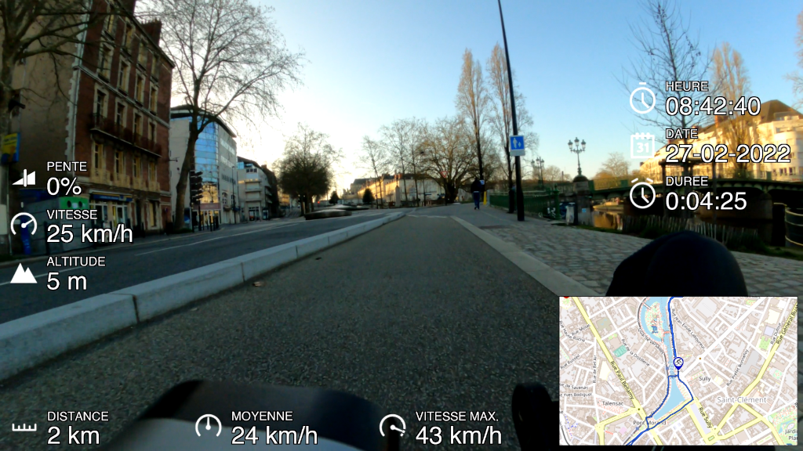
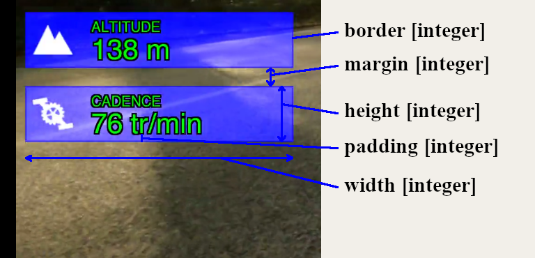

# GPX2Video tool - Telemetry overlay

GPX GoPro Quick not working ? No tool working with Linux distribution. That's why I have written 
this small tool to extract telemetry data to enable stickers or gauges on your videos.

GPX2Video can convert the data recorded by your GoPro (GPS, accelerometer, camera settings and more)
or reads an input GPX file. Visualize data or maps on your videos.

Finally, gpx2video should work with any camera and you are able to customize your gauges and much more.
gpx2vidoe supports the timelapse / timewrap video too.

gpx2video is **only a test tool and isn't yet a final release!**



*Please test and report issues. Tested with GoPro 5, 6, 7, 8 and 9 (with last firmware).*


## Features

gpx2video should work with any video. Orientation, SAR & DAR video parameters are supported.

gpx2video can read and extract from your gpx input file:
  - time, 
  - position, 
  - elevation, 
  - speed, 
  - average speed, 
  - max speed,
  - heartrate, 
  - cadence,
  - temperature

gpx2video can extract GPMD data from GoPro GPMD stream in several format:
  - Text dump
  - RAW dump
  - GPX data

gpx2video can draw a map widget with your track. It supports multi map source: 
  - OpenStreetMap I © OpenStreetMap contributors
  - Maps-For-Free Maps © Maps-For-Free
  - OpenCycleMap Maps © thunderforest.com, Data © osm.org/copyright
  - OpenTopoMap © OpenTopoMap (CC-BY-SA)
  - Public Transport Maps © ÖPNVKarte, Data © OpenStreetMap contributors
  - Google Maps Map provided by Google
  - Google Satellite Map provided by Google 
  - Google Hybrid Map provided by Google
  - Virtual Earth Map provided by Microsoft
  - Virtual Earth Satellite Map provided by Microsoft
  - Virtual Earth Hybrid Map provided by Microsoft
  - IGN Essentiel Map Map provided by IGN
  - IGN Essentiel Photo Map provided by IGN

gpx2video can synchronize your video with your gpx input file.


## How it works ?

gpx2video is able to extract and parse metadata and sensor data recorded by your GoPro.

```bash
$ ffprobe GH010337.MP4
ffprobe version 3.2.2 Copyright (c) 2007-2016 the FFmpeg developers
  built with gcc 6.2.1 (Debian 6.2.1-5) 20161124
...
Input #0, mov,mp4,m4a,3gp,3g2,mj2, from 'GH010337.MP4':
  Metadata:
    major_brand     : mp41
    minor_version   : 538120216
    compatible_brands: mp41
    creation_time   : 2021-12-08T09:56:26.000000Z
...
  Duration: 00:00:52.38, start: 0.000000, bitrate: 100345 kb/s
    Stream #0:0(eng): Video: h264 (High) (avc1 / 0x31637661), yuvj420p(pc, bt709), 2704x1520 [SAR 1:1 DAR 169:95], 100078 kb/s, 50 fps, 50 tbr, 90k tbn, 100 tbc (default)
    Metadata:
      creation_time   : 2021-12-08T09:56:26.000000Z
      handler_name    : GoPro AVC  
      encoder         : GoPro AVC encoder
      timecode        : 09:56:26:43
    Stream #0:1(eng): Audio: aac (LC) (mp4a / 0x6134706D), 48000 Hz, stereo, fltp, 189 kb/s (default)
    Metadata:
      creation_time   : 2021-12-08T09:56:26.000000Z
      handler_name    : GoPro AAC  
      timecode        : 09:56:26:43
    Stream #0:2(eng): Data: none (tmcd / 0x64636D74) (default)
    Metadata:
      creation_time   : 2021-12-08T09:56:26.000000Z
      handler_name    : GoPro TCD  
      timecode        : 09:56:26:43
    Stream #0:3(eng): Data: none (gpmd / 0x646D7067), 48 kb/s (default)
    Metadata:
      creation_time   : 2021-12-08T09:56:26.000000Z
      handler_name    : GoPro MET  
    Stream #0:4(eng): Data: none (fdsc / 0x63736466), 12 kb/s (default)
    Metadata:
      creation_time   : 2021-12-08T09:56:26.000000Z
      handler_name    : GoPro SOS  
```

gpx2video uses the `creation_time` field to synchronize your video with your GPX file. Warning, `creation_time`
is in local time. But this date isn't synchronized with the GPS source.

If gpx2video finds the 'GoPro MET' stream, it searches packet with GPS fix to determine the offset time to use.

If the `creation_time` field and 'GoPro MET' stream can't be found, gpx2video assumes that the video starts in the
same time that the GPX stream.

"sync" command permits to test the sychronization process:

```bash
$ ./gpx2video -v -m GOPR1860.MP4 sync
Time synchronization...
PACKET: 0 - PTS: 0 - TIMESTAMP: 0 ms - TIME: 2022-01-16 10:05:03 - GPS FIX: 0 - GPS TIME: 2022-01-16 10:01:38.959 - OFFSET: -205
PACKET: 1 - PTS: 1000 - TIMESTAMP: 1000 ms - TIME: 2022-01-16 10:05:04 - GPS FIX: 0 - GPS TIME: 2022-01-16 10:01:40.939 - OFFSET: -204
PACKET: 2 - PTS: 2000 - TIMESTAMP: 2000 ms - TIME: 2022-01-16 10:05:05 - GPS FIX: 0 - GPS TIME: 2022-01-16 10:01:41.929 - OFFSET: -204
PACKET: 3 - PTS: 3000 - TIMESTAMP: 3000 ms - TIME: 2022-01-16 10:05:06 - GPS FIX: 0 - GPS TIME: 2022-01-16 10:01:42.919 - OFFSET: -204
...
PACKET: 20 - PTS: 20000 - TIMESTAMP: 20000 ms - TIME: 2022-01-16 10:05:23 - GPS FIX: 0 - GPS TIME: 2022-01-16 10:01:59.969 - OFFSET: -204
PACKET: 21 - PTS: 21000 - TIMESTAMP: 21000 ms - TIME: 2022-01-16 10:05:24 - GPS FIX: 0 - GPS TIME: 2022-01-16 10:02:00.959 - OFFSET: -204
PACKET: 22 - PTS: 22000 - TIMESTAMP: 22000 ms - TIME: 2022-01-16 10:05:25 - GPS FIX: 0 - GPS TIME: 2022-01-16 10:02:01.949 - OFFSET: -204
PACKET: 23 - PTS: 23000 - TIMESTAMP: 23000 ms - TIME: 2022-01-16 10:05:26 - GPS FIX: 0 - GPS TIME: 2022-01-16 10:02:02.939 - OFFSET: -204
PACKET: 24 - PTS: 24000 - TIMESTAMP: 24000 ms - TIME: 2022-01-16 10:05:27 - GPS FIX: 2 - GPS TIME: 2022-01-16 10:02:03.929 - OFFSET: -204
Video stream synchronized with success
```

At last, but not least, you can add an user offset (in ms).

```bash
$ ./gpx2video -m GOPR1860.MP4 --offset 9000 ...
```


## Build

To build gpx2video, please install all dependancies (on Debian):

```bash
apt-get install cmake g++ libevent-dev libssl-dev libcurl4-gnutls-dev \
    libavutil-dev libavformat-dev libavcodec-dev libavfilter-dev \
    libswresample-dev libswscale-dev libopenimageio-dev libgeographic-dev \
    libcairo2-dev libopenexr-dev
```

Then build in using cmake tools:

```bash
$ git clone https://github.com/progweb/gpx2video.git
$ mkdir gpx2video/build
$ cd gpx2video/build
$ cmake ..
$ make
$ ln -s ../assets assets
$ ./gpx2video -h
```

*Please execute gpx2video tool from the build path so as it finds assets data.*


## Usage

gpx2video is a command line tool.

  - To extract GoPro GPMD data from media stream:

```bash
$ ./gpx2video -v -m GOPR1860.MP4 -o output.gpx -f 3 extract
gpx2video v0.0.0
creation_time = 2020-12-13T09:56:27.000000Z
Failed to find decoder for stream #2
Failed to find decoder for stream #3
Input #0, mov,mp4,m4a,3gp,3g2,mj2, from '../../video/GOPR1860.MP4':
...
Extract GPMD data...
PACKET: 0 - PTS: 0 - TIMESTAMP: 0 ms - TIME: 1970-01-01 00:00:00
PACKET: 1 - PTS: 1001 - TIMESTAMP: 1001 ms - TIME: 1970-01-01 00:00:01
```

  - To render image per image with telemetry data:

```bash
$ mkdir png
$ ./gpx2video -v -m GH020340.MP4 -g ACTIVITY.gpx -l layout.xml -o png/image-XXXXXX.png image
gpx2video v0.0.0
...
```

One image per second will be generated. 'XXXXXX' will be replaced by the frame number

  - To render a video stream with telemetry data:

```bash
$ ./gpx2video -v -m GH020340.MP4 -g ACTIVITY.gpx -l layout.xml -o output.mp4 video
gpx2video v0.0.0
creation_time = 2021-12-08T10:34:50.000000Z
...
[read the input media metadata]
...
Track info:
  Name        : Road biking
  Comment     : 
  Description : 
  Source      : 
  Type        : road_biking
  Number      : 
  Segments:   : 1
Output #0, mp4, to 'output-overview.mp4':
  Stream #0:0: Video: h264, yuvj420p(pc), 2704x1520 [SAR 1:1 DAR 169:95], q=2-31, 32000 kb/s, 50 tbn
  Stream #0:1: Audio: aac (LC), 48000 Hz, stereo, fltp, 128 kb/s
Parsing layout.xml
Load widget 'grade'
Initialize grade widget
Load widget 'speed'
Initialize speed widget
Load widget 'elevation'
Initialize elevation widget
Load widget 'cadence'
Initialize cadence widget
Load map widget
Initialize map widget
Cache initialiization...
Time synchronization...
PACKET: 0 - PTS: 0 - TIMESTAMP: 0 ms - TIME: 2021-12-08 09:34:50 - GPS TIME: - OFFSET: 478042309
PACKET: 1 - PTS: 1000 - TIMESTAMP: 1000 ms - TIME: 2021-12-08 09:34:51 - GPS TIME: 2021-12-08 09:38:36.850 - OFFSET: 225
Video stream synchronized with success
Download map from OpenStreetMap I...
  Download tile 6 / 6 [##################################################] DONE
...
[Download, build map then draw your track]
...
Build map...
FRAME: 0 - PTS: 0 - TIMESTAMP: 0 ms - TIME: 2021-12-08 10:38:35
  Time: 2021-12-08 10:38:38. Distance: 35.841 km in 6330.000 seconds, current speed is 25.817 (valid: true)
FRAME: 1 - PTS: 1800 - TIMESTAMP: 20 ms - TIME: 2021-12-08 10:38:35
  Time: 2021-12-08 10:38:38. Distance: 35.841 km in 6330.000 seconds, current speed is 25.817 (valid: true)
[Process each frame]
...
```


### How change gauges ?

Gauges size and position and more can be set from the layout.xml file. (see: samples/layout-1920x1080.xml)

You can edit `layout.xml` file to enable/disable gauge or edit label and position or any settings:
```xml
<?xml version="1.0" encoding="UTF-8"?>
<layout>
	<widget x="250" y="450" width="600" height="120" position="left" align="vertical">
		<type>speed</type>
		<name>VITESSE</name>
		<margin>20</margin>
		<padding>5</padding>
		<unit>kph</unit>
	</widget>		
	<widget x="250" y="450" width="600" height="120" position="left" align="vertical">
		<type>elevation</type>
		<name>ALTITUDE</name>
		<margin>20</margin>
		<padding>5</padding>
		<unit>m</unit>
	</widget>
	<widget x="250" y="450" width="600" height="120" position="right" align="vertical">
		<type>date</type>
		<name>DATE</name>
		<margin>20</margin>
		<padding>5</padding>
		<format>%d-%m-%Y</format>
	</widget>
	<widget x="250" y="450" width="600" height="120" position="left" align="vertical" display="false">
		<type>heartrate</type>
		<name>FREQ. CARDIAQUE</name>
		<margin>20</margin>
		<padding>5</padding>
	</widget>		
	<track x="800" y="300" width="640" height="480" position="none" display="false">
	</track>
	<map x="800" y="300" width="640" height="480" position="none">
		<source>1</source>
		<zoom>12</zoom>
		<factor>2.0</factor>
	</map>
</layout>
```


#### Widget common settings

Here all widget common element settings:

```xml
<widget x="250" y="450" width="600" height="120" position="left" align="vertical" at="1000" duration="9000" display="true">
	<type>speed</type>
	<name>VITESSE</name>
	<margin>20</margin>
	<padding>5</padding>
	<font>/usr/share/fonts/truetype/freefont/FreeSerifItalic.ttf</font>
	<text-color>#00ff00ff</text-color>
	<text-ratio>2.0</text-ratio>
	<text-shadow>3</text-shadow>
	<text-linespace>2</text-linespace>
	<label-align>left</label-align>
	<value-align>right</value-align>
	<border>5</border>
	<border-color>#000000b0</border-color>
	<background-color>#0000004c</background-color>
	<with-label>true</with-label>
	<with-value>true</with-value>
	<with-picto>true</with-picto>
	<with-unit>true</with-unit>
</widget>		
```

Node attributes are:
  - **x** / **y**: to set the widget position.
  - **width** / **height**: to set the widget size.
  - **position**: to compute the widget position.
  - **align**: to set the align direction.
  - **at** / **duration**: to display widget at a specific time (in ms) during a specific duration (in ms).
  - **display**: to render or not the widget.

Node elements are:
  - **type**: to set the widget type (speed, grade, distance...).
  - **name**: to set the widget label.
  - **font**: to set the text font.
  - **margin**: to set the space around the widget (**margin-left**, **margin-right**, **margin-top** and **margin-bottom** are supported too).
  - **padding**: to set the space inside the widget (**padding-left**, **padding-right**, **padding-top** and **padding-bottom** are supported too).
  - **border**: to set the border width.
  - **border-color**: to set the border color in #RGBA.
  - **background-color**: to set the background color in #RGBA.
  - **text-color**: to set the text color in #RGBA.
  - **text-ratio**: define the label and value size ratio.
  - **text-shadow**: text shadow thickness.
  - **text-linespace**: line space between label and value.
  - **label-align**: to set text alignement (left, center, right)
  - **value-align**: to set value alignement (left, center, right)
  - **with-xxxx**: to show or not the field (default is true).

**type** gauges supported are:
  - speed, maxspeed, avgspeed, avgridespeed
  - grade, elevation
  - date, time, duration
  - position
  - distance
  - cadence
  - heartrate
  - temperature
  - image
  - lap
  - text

**position** values are: none, left, right, top, bottom, bottom-left, bottom-right, top-left, top-right.
If **position** element is set, gpx2video ignores and computes **x** and **y** values.

**align** values are: horizontal or vertical.
If **position** isn't defined, align value isn't used.

**display** values are: true or false. It permits to render or not the widget.
The **display** default value is true.



**padding** value sets the space around the text. Whereas, **margin** value defines the space around the widget.


#### speed, maxspeed, avgspeed and avgridespeed widgets

```xml
<widget>
	<type>speed</type>
	<unit>kph</unit>
</widget>		
```

**unit** values are: mph or kph.


#### distance widget

```xml
<widget>
	<type>distance</type>
	<unit>km</unit>
</widget>		
```

**unit** values are: m, km, ft or miles.


#### elevation widget

```xml
<widget>
	<type>elevation</type>
	<unit>m</unit>
</widget>		
```

**unit** values are: m or ft.


#### date widget

```xml
<widget>
	<type>date</type>
	<format>%Y-%m-%d</format>
</widget>		
```


#### temperature widget

```xml
<widget>
	<type>temperature</type>
	<unit>C</unit>
</widget>		
```

**unit** values are: C, celsius or F, fahrenheit.


#### lap widget

```xml
<widget>
	<type>lap</type>
	<nbr-lap>10</nbr-lap>
</widget>		
```

**nbr-lap** value is the lap target number.


#### image widget

```xml
<widget>
	<type>image</type>
	<zoom>stretch</zoom>
	<source>fichier.jpg</source>
</widget>		
```

**zoom** values are: none, fit, fill, crop and stretch. This parameter is used only by the image widget.
**source** is optional.


#### text widget

```xml
<widget>
	<type>text</type>
	<text>Rendered with GPX2Video application</text>
</widget>		
```


## Maps

You can specify map source from a list. Warning, all maps aren't free.

gpx2video downloads each tile with the zoom level in your `~/.gpx2video/cache` path. 
Then build the map.

Finally, gpx2video renders a mapbox in applying the zoom factor.

As you use map or track command line, please provide map settings (source, zoom, factor) on the
command lines.

  - To render map:

```bash
$ ./gpx2video -g ACTIVITY.gpx -o map.png --map-source=1 --map-zoom=11 --map-factor 2.0 map
```

  - To render map & track:

```bash
$ ./gpx2video -g ACTIVITY.gpx -o map.png --map-source=1 --map-zoom=11 --map-factor 2.0 track
```

Map settings: 

```xml
<map x="250" y="450" width="600" height="120" position="left" display="true">
	<source>1</source>
	<zoom>11</zoom>
	<factor>1.2</factor>
	<marker>60</marker>
	<border>5</border>
	<border-color>#000000b0</border-color>
	<background-color>#0000004c</background-color>
	<path-thick>3.0</path-thick>
	<path-border>1.4</path-border>
</map>		
```

**zoom** value sets the map details.
**factor** value applies a zoom factor as render.
**marker** marker size in pixels.
**path-thick** path thick.
**path-border** border size of path.

Map widget can be auto positionned as **x**, **y** and/or **width**, **height** aren't set. 
At last, you can define several map widgets.

*Map widget accepts the same common attibutes and elements that the standard widget (**at**, **duration**...)*


## Tracks

You can also display only the track without the map background in using track widget.

Track settings: 

```xml
<track x="250" y="450" width="600" height="120" position="left" display="true">
	<marker>60</marker>
	<border>5</border>
	<border-color>#000000b0</border-color>
	<background-color>#0000004c</background-color>
	<path-thick>3.0</path-thick>
	<path-border>1.4</path-border>
</widget>		
```

*Track widget accepts the same common attibutes and elements that the standard widget (**at**, **duration**...)*

**path-thick** path thick.
**path-border** border size of path.

## Extract tools

You can extract and parse GoPro MET stream:

```bash
$ ./gpx2video -m GH010434.MP4 -o data.txt -f 1 extract
```

Or, you can extract the GoPro MET stream as raw data:

```bash
$ ./gpx2video -m GH010434.MP4 -o data.bin -f 2 extract
```

As exiftool, you can extract GPX from GoPro MP4 video file too:

```bash
$ ./gpx2video -m GH010434.MP4 -o track.gpx -f 3 extract
```

In future release, gpx2video should be able to use more data from this stream as accelerometer and gyroscope.


## Telemetry tools

You can convert, filter and interpolate GPX data.

```bash
$ ./gpx2video -g ACTIVITY.gpx -o data.csv --telemetry=0 compute
```

This tool permits to convert GPX to CSV and/or apply a filter on the GPS data (lat. and lon. values).
Since gpx2video interpolates data each 1s in using different filters: linear, kalman or interpolation.

*Note: The result isn't yet satisfactory* 


## Video encoder settings (in progress)

You can set few encoder settings:

```bash
$ ./gpx2video -v -m GH020340.MP4 -g ACTIVITY.gpx -l layout.xml \
    --video-codec=h264 --video-preset=ultrafast --video-crf=31 -o output.mp4 video
```

To use target bitrate compression method:

```bash
$ ./gpx2video -v -m GH020340.MP4 -g ACTIVITY.gpx -l layout.xml \
    --video-codec=h264 --video-preset=ultrafast --video-crf=-1 -o output.mp4 video
```

**video-options** supported are:
  - codec: h264 (default), h264_nvenc, hevc or hevc_nvenc
  - preset: ultrafast, superfast, veryfast, faster, fast, medium (default), slow and veryslow
  - crf: constant rate factor values range from 0 to 51 (default: 27 for h264 & 31 for hevc)
  - bitrate: value (default: 16000000)
  - min-bitrate: value (default: 0)
  - max-bitrate: value (default: 32000000)

*To use target bitrate, set crf to '-1' to disable constant compression method.*

```bash
$ ./gpx2video -v -m GH020340.MP4 -g ACTIVITY.gpx -l layout.xml \
    --video-codec=hevc --video-preset=slow --video-crf=-1 \
    --video-bitrate=16000000 --video-max-bitrate=32000000 -o output.mp4 video
```

## ToDo

  - Render gauge:
    - hflip: flip icon and label
    - gpx fix mode: disable gauge on nofix
    - svg: add icon svg support
  - Render maps (alpha, size, position, zoom...)
  - Render track (color, remaining, speed gradient...)
  - Gallery photo import
  - User interface integration
  - GPS interpolate data between two waypoints.
  - 360 videos support


## Overlay software

Here, you can find other solutions working on Linux:

  - GoPro Map Sync - (https://github.com/thomergil/gopro-map-sync)
  - Overlaying Dashboard - (https://github.com/time4tea/gopro-dashboard-overlay)
  - GPS data overlay on videos - (https://github.com/peregin/gps-overlay-on-video)


## Credits

gpx2video is based on several open source libraries:
  - libevent - (https://libevent.org)
  - libcurl - (https://curl.se/libcurl)
  - ffmpeg - (https://ffmpeg.org)
  - gpxlib - (http://irdvo.nl/gpxlib)
  - osm-gps-map - (http://nzjrs.github.io/osm-gps-map)
  - cairo - (https://www.cairographics.org)
  - olive - (https://www.olivevideoeditor.org)
  - OpenImageIO - (https://sites.google.com/site/openimageio/home)

