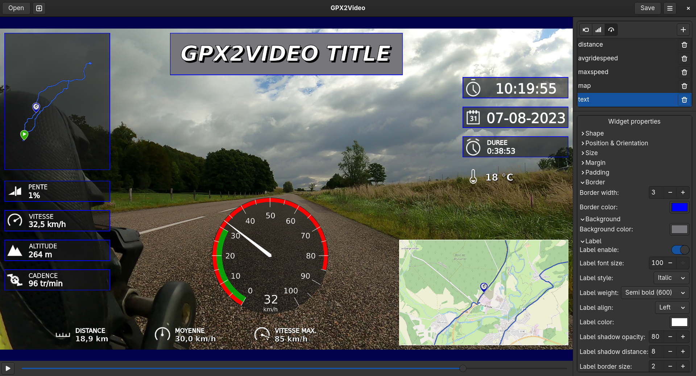
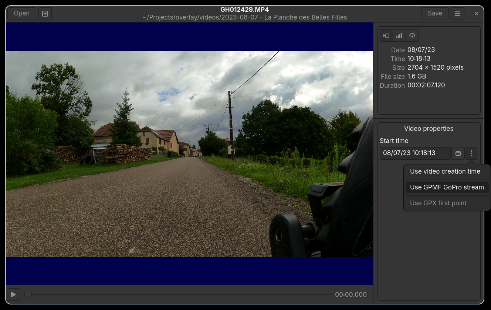
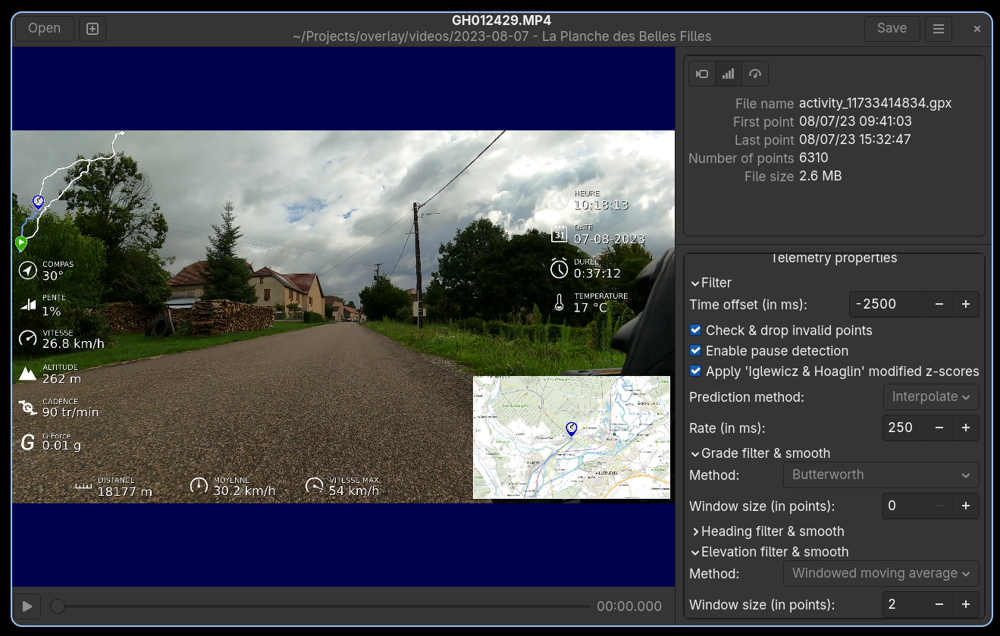
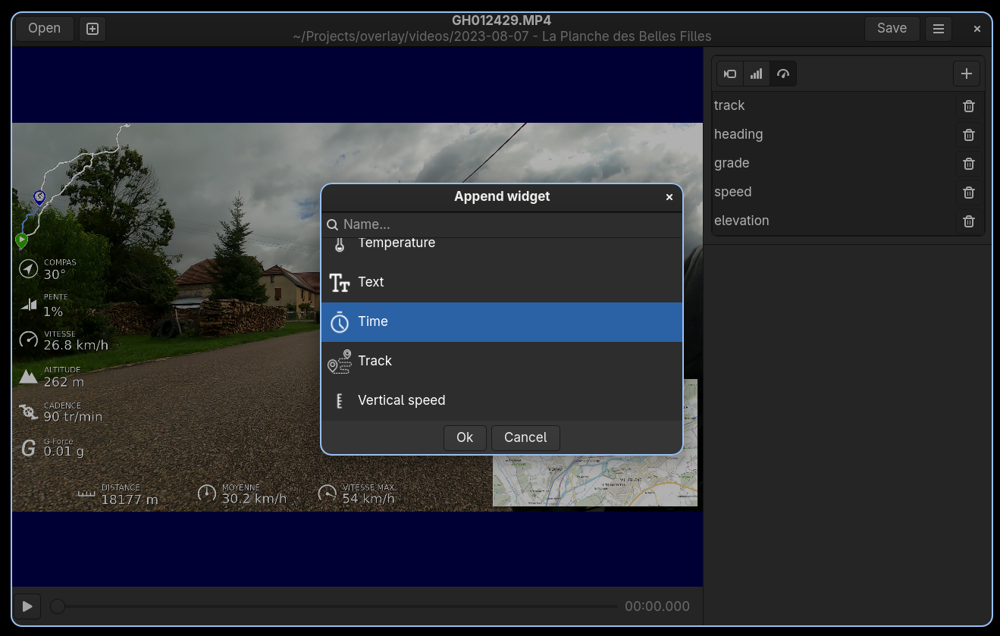
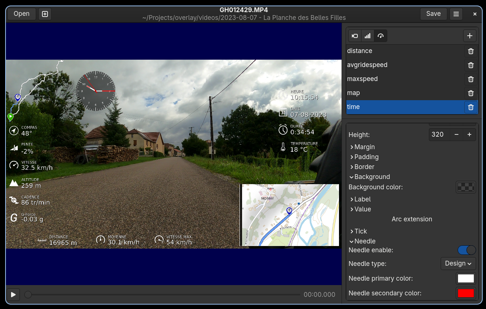

# GPX2Video tool - Telemetry overlay

GPX GoPro Quick not working ? No tool working with Linux distribution. That's why I have written 
this small tool to extract telemetry data to enable stickers or gauges on your videos.

GPX2Video can convert the data recorded by your GoPro (GPS, accelerometer, camera settings and more)
or reads an input GPX file. Visualize data or maps on your videos.

Finally, gpx2video should work with any camera and you are able to customize your gauges and much more.
gpx2vidoe supports the timelapse / timewrap video too.

gpx2video development is **in progress and isn't yet a final release!**

*Please test and report issues. Tested with GoPro 5, 6, 7, 8 and 9 (with last firmware).*

## User interface

User interface uses GTKMM-4 API. It intends to edit and export your layout file.
Then view renderer result.



*Please follow documentation to build gpx2video with gtk interface.*

## Features

gpx2video should work with any video. Orientation, SAR & DAR video parameters are supported.

gpx2video can read and extract from your gpx input file:
  - time, 
  - position, 
  - elevation, 
  - speed, 
  - average speed, 
  - max speed,
  - heartrate, 
  - cadence,
  - temperature

gpx2video can extract GPMD data from GoPro GPMD stream in several format:
  - Text dump
  - RAW dump
  - GPX data

gpx2video can draw a map widget with your track. It supports multi map source: 
  - OpenStreetMap I © OpenStreetMap contributors
  - Maps-For-Free Maps © Maps-For-Free
  - OpenCycleMap Maps © thunderforest.com, Data © osm.org/copyright
  - OpenTopoMap © OpenTopoMap (CC-BY-SA)
  - Public Transport Maps © ÖPNVKarte, Data © OpenStreetMap contributors
  - Google Maps Map provided by Google
  - Google Satellite Map provided by Google 
  - Google Hybrid Map provided by Google
  - Virtual Earth Map provided by Microsoft
  - Virtual Earth Satellite Map provided by Microsoft
  - Virtual Earth Hybrid Map provided by Microsoft
  - IGN Essentiel Map Map provided by IGN
  - IGN Essentiel Photo Map provided by IGN

gpx2video can synchronize your video with your gpx input file.


## Build

### Build in docker

#### Debian

By default docker will use debian:12.8-slim as base image, but you can change it.

```bash
make build-docker
make build-gpx2video
```

Copy video files to data folder then you can start docker and try it out

```bash
make run VIDEO_DIR=~/Videos

# run gpx2video
./gpx2video -v -m /data/SOME_VID.mp4 -g /data/SOME_GPX.gpx -l /data/layout.xml -o /data/output.mp4
```

#### Ubuntu

If you prefer build & run for ubuntu, fist create docker image, then build the application.

```bash
make ubuntu-noble
```

To rebuild the applicatio

```bash
make buid-ubuntu-noble
```

To execute the application

```bash
make run-ubuntu-noble VIDEO_DIR=~/Videos

# run gpx2video
./tools/gpx2video -v -m /data/SOME_VID.mp4 -g /data/SOME_GPX.gpx -l /data/layout.xml -o /data/output.mp4
```

### Build on host

[Please follow documentation to build gpx2video without gtk interface.](tools/README.md)

To build gpx2video, please install all dependencies (on Debian):

```bash
apt-get install cmake g++ gettext libevent-dev libssl-dev libcurl4-gnutls-dev \
    libavutil-dev libavformat-dev libavcodec-dev libavfilter-dev \
    libswresample-dev libswscale-dev libopenimageio-dev libgeographic-dev \
    libpango1.0-dev libcairo2-dev librsvg2-dev libopenexr-dev libfreetype-dev \
    libpulse-dev libgtkmm-4.0-dev libglibmm-2.68-dev libepoxy-dev libglm-dev
```

*Warning, on some distribution, libgeographic-dev is called libgeographiclib-dev!*

Then build in using cmake tools:

```bash
$ git clone https://github.com/progweb/gpx2video.git
$ mkdir gpx2video/build
$ cd gpx2video/build
$ cmake ..
$ make
$ ./gtk/gpx2video-gtk -h
$ ./tools/gpx2video -h
```

*Please execute gpx2video tool from the build path so as it finds assets data.*

### Assets installation

gpx2video searches assets path in the order:
- &lt;builddir&gt;/assets
- &lt;sourcedir&gt;/assets
- $HOME/.local/share/gpx2video
- /usr/share/gpx2video
- ./assets

### Install gpx2video icons

```bash
mkdir -p ~/.local/share/icons/hicolor
cp -a gtk/icons/48x48 gtk/icons/scalable ~/.local/share/icons/hicolor

gtk-update-icon-cache
```

### Add gpx2video desktop application menu entry

```bash
desktop-file-install --dir=$HOME/.local/share/applications gtk/data/com.progweb.gpx2video.desktop
update-desktop-database ~/.local/share/applications
xdg-desktop-menu forceupdate
```

### Add gpx2video gsettings file 

```bash
sudo cp -a gtk/data/com.progweb.gpx2video.gschema.xml /usr/share/glib-2.0/schemas
sudo glib-compile-schemas /usr/share/glib-2.0/schemas
```


## gpx2video interface usage

Exec the application without argument:

```bash
$ ./gtk/gpx2video-gtk GH020340.MP4
```

Or with your video:

```bash
$ ./gtk/gpx2video-gtk
```

### Player usage

Shortkey:
  - Key 'left arrow': -10.0 seconds 
  - Key 'right arrow': 10.0 seconds
  - Key 'down arrow': -60.0 seconds
  - Key 'up arrow': 60.0 seconds
  - Key 's': step one frame
  - Key 'f': fullscreen mode
  - Key 'space': play/pause

### Video start time settings



You can set the video start time from :
- the calendar
- the video metadata
- the telemetry first point
- the GPMF stream (if GoPro stream is detected)

### Telemetry settings



You can adjust the telemetry settings for the video preview.

*Telemetry settings aren't yet exported for final rendering.*

### Widgets settings



You can append your widget.



Then customize the widget rendering.

## gpx2video command line tools

The gpx2video interface permits to select widgets and edit your layout.

To render the final video, gpx2video command line tool is required.

gpx2video is provided with several tools to extract, convert... your telemetry data.

### Extract tools

You can extract and parse GoPro MET stream:

```bash
$ ./tools/gpx2video -m GH010434.MP4 -o data.txt --extract-format=1 extract
```

Or, you can extract the GoPro MET stream as raw data:

```bash
$ ./tools/gpx2video -m GH010434.MP4 -o data.bin --extract-format=2 extract
```

As exiftool, you can extract GPX from GoPro MP4 video file too:

```bash
$ ./tools/gpx2video -m GH010434.MP4 -o track.gpx --extract-format=3 extract
```

In future release, gpx2video should be able to use more data from this stream as accelerometer and gyroscope.


### Telemetry settings

Telemetry data are computed from GPX (other format are supported too). As telemetry data file is loaded, 
you can apply different filters. You can export the results to test:

```bash
$ ./tools/gpx2video -g ACTIVITY.gpx -o data.csv compute
```

This tool permits to convert GPX to CSV and/or apply a filter on the GPS data (lat. and lon. values).
gpx2video interpolates data in using different methods: linear, kalman or interpolation.

By default, telemetry is updated each 1000 ms. You can overwrite this value :

```bash
$ ./tools/gpx2video -v -m GH020340.MP4 -g ACTIVITY.gpx -l layout.xml \
    --telemetry-method=3 --telemtry-rate=500 -o output.mp4 video
```

gpx2video accepts the same options that gpxtools.

CSV format is given by gpx2video or gpxtools. Columns (no case sensitive) supported are:
  - Timestamp (in ms)
  - Total Duration (seconds)
  - Partial Duration (seconds)
  - Ride Time (seconds)
  - Data (U: Unknown, M: Measured, F: Fixed, P: Predicted, C: Unchanged, E: Error)
  - Lat / Latitude
  - Lon / Longitude
  - Ele / Elevation
  - Grade
  - Distance (meter)
  - Heading (degrees)
  - Speed (kph)
  - Max Speed (kph)
  - Average (kph)
  - Ride Average (kph)
  - Vertical Speed (mps)
  - Cadence
  - Heartrate (bpm)
  - Temperature (degrees)
  - Power
  - Lap


### Telemetry tools

gpxtools can be used to filter, convert or compute GPX data.

```bash
$ ./tools/gpxtools -i ACTIVITY.gpx --telemetry-method=0 -o data.csv convert
$ ./tools/gpxtools -i ACTIVITY.gpx --telemetry-method=0 -o data.csv compute
```

You can extract a part of your GPX data in using **--begin** and **--end** option.
gpxtools can change samples rate too.

```bash
$ ./gpxtools -i ACTIVITY.gpx \
    --begin "2024-10-28 09:00:00" --end "2024-10-28 10:00:00" \
    --telemetry-method=3 --telemetry-rate=3000 \
    -o data.gpx compute
```

As you use **compute** command, other settings permit to smooth data:

```bash
$ ./tools/gpxtools -i ACTIVITY.gpx \
    --telemetry-check=true \
    --telemetry-pause_detection=true \
	--telemetry-filter=1 \
	--telemetry-smooth=data=speed,method=1,points=2 \
	--telemetry-method=3 --telemtry-rate=500 \
	-o data.gpx compute
```

**--telemetry-check** drops invalid points, before compute.

**--telemetry-pause-detection** detects pause and adjust speed and other data.

**--telemetry-filter** filter and update all incoherent points, then compute telemetry data.

**--telemetry-smooth** to smooth telemetry data results on several points. Telemetry smooth argument 
format value is: "data=type,method=<smooth method>,points=<number of points>". Data type can be
"grade", "speed", "heading", "elevation", "acceleration" or "verticalspeed". 

Smooth method is given by the option **--telemtry-smooth-list**.

**--from** and **--to** permits to define a datetime range where compute telemetry data. It can be used
as you want compute data only on a segment. Outside this segment, only few data are computed. **--from**
and **--to** range has to be in the data range defined by **--begin** and **--end**.

### Video encoder settings (in progress)

You can set few encoder settings:

```bash
$ ./tools/gpx2video -v -m GH020340.MP4 -g ACTIVITY.gpx -l layout.xml \
    --video-codec=h264 --video-preset=ultrafast --video-crf=31 -o output.mp4 video
```

To use target bitrate compression method:

```bash
$ ./tools/gpx2video -v -m GH020340.MP4 -g ACTIVITY.gpx -l layout.xml \
    --video-codec=h264 --video-preset=ultrafast --video-crf=-1 -o output.mp4 video
```

**video-options** supported are:
  - codec: 
    - h264 (default), h264_nvenc, h264_vaapi, h264_qsv
    - hevc, hevc_nvenc, hevc_qsv
  - hwdevice: dri node device (if not defined, print available dri nodes list)
  - preset: ultrafast, superfast, veryfast, faster, fast, medium (default), slow and veryslow
    (or specific values for hardware codec)
  - crf: constant rate factor values range from 0 to 51 (default: 27 for h264 & 31 for hevc)
  - bitrate: value (default: 16000000)
  - min-bitrate: value (default: 0)
  - max-bitrate: value (default: 32000000)

*To use target bitrate, set crf to '-1' to disable constant compression method.*

```bash
$ ./tools/gpx2video -v -m GH020340.MP4 -g ACTIVITY.gpx -l layout.xml \
    --video-codec=hevc --video-preset=slow --video-crf=-1 \
    --video-bitrate=16000000 --video-max-bitrate=32000000 -o output.mp4 video
```


## ToDo & Roadmap

v0.1.0: First release in command line

v0.2.0 (in devel):
  - User interface integration
  - Render fonts with pango
  - Render first gauges
  - Render maps (size, position, zoom...)
  - Render track (color, remaining...)
  - SVG icons

next_release:
  - More gauge settings (hflip, rotate, icons...)
  - More gauge shapes
  - Render maps (alpha, round maps...)
  - Render track (speed gradient...)
  - Gallery photo import
  - 360 videos support


## Overlay software

Here, you can find other solutions working on Linux:

  - GoPro Map Sync - (https://github.com/thomergil/gopro-map-sync)
  - Overlaying Dashboard - (https://github.com/time4tea/gopro-dashboard-overlay)
  - GPS data overlay on videos - (https://github.com/peregin/gps-overlay-on-video)


## Credits

gpx2video is based on several open source libraries:
  - libevent - (https://libevent.org)
  - libcurl - (https://curl.se/libcurl)
  - ffmpeg - (https://ffmpeg.org)
  - gpxlib - (http://irdvo.nl/gpxlib)
  - osm-gps-map - (http://nzjrs.github.io/osm-gps-map)
  - cairo - (https://www.cairographics.org)
  - olive - (https://www.olivevideoeditor.org)
  - OpenImageIO - (https://sites.google.com/site/openimageio/home)

