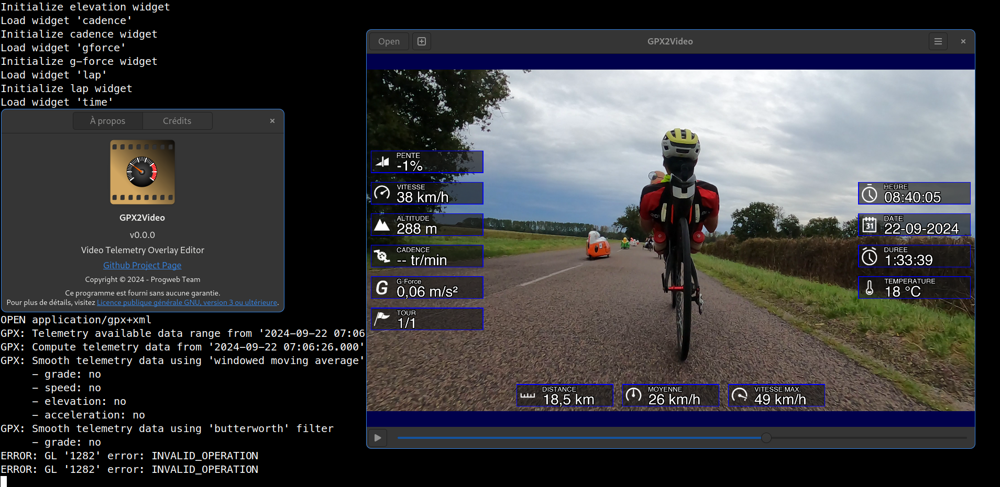

# GPX2Video - Telemetry overlay

GTK interface for gpx2video tool.




## Features

*Dev in progress*


## Data installation

### Install gpx2video icons

```bash
mkdir -p ~/.local/share/icons/hicolor
cp -a icons/48x48 icons/scalable ~/.local/share/icons/hicolor

gtk-update-icon-cache
```

### Add gpx2video desktop application menu entry

```bash
desktop-file-install --dir=$HOME/.local/share/applications data/com.progweb.gpx2video.desktop
update-desktop-database ~/.local/share/applications
xdg-desktop-menu forceupdate
```


## Build

### Build on host

To build gpx2video, please install all gpx2video tool dependencies 
and gtk-4 libraries (on Debian):

```bash
apt-get install libgtkmm-4.0-dev libglibmm-2.68-dev libepoxy-dev
```

Then build in using cmake tools:

```bash
$ git clone https://github.com/progweb/gpx2video.git
$ mkdir gpx2video/build
$ cd gpx2video/build
$ cmake -DBUILD_GTK=ON ..
$ make
$ ./gtk/gpx2video
```

### Build in docker

#### Debian

By default docker will use debian:12.8-slim as base image, but you can change it.

```bash
make build-docker
make build-gpx2video
make run-gpx2video VIDEO_DIR=~/Video
./gtk/gpx2video /data/video.mp4
```


## Usage

Shortkey:
  - Key 'left arrow': -10.0 seconds 
  - Key 'right arrow': 10.0 seconds
  - Key 'down arrow': -60.0 seconds
  - Key 'up arrow': 60.0 seconds
  - Key 's': step one frame

