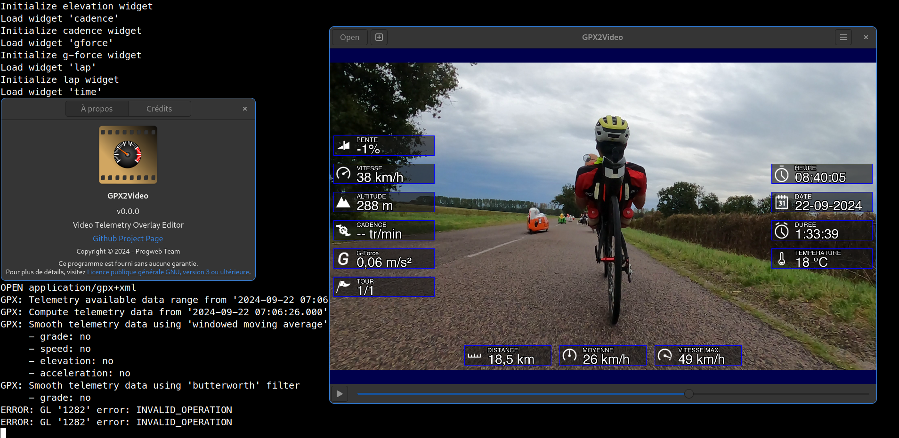

# GPX2Video - GTK interface

GTK interface for gpx2video tool.

## Features

User interface feature:
- video loading
- video start time setting (from video metadata, GPMF or GPX and from calendar)
- layout file loading & exporting
- telemetry file loading
- telemetry settings 
- widget settings
- locales detection

To fix:
- sound player (issue on some device)

To do:
- redraw each icon (in real svg)
- to be able to use user icons
- arc & bar settings customization
- add more widget shapes (ramp & curve)
- add chart support
- text editable for the 'text' widget
- option to enable / disable sound
- optimization & fix cpu usage
- add progress bar, bufferization information...

## Software thread architecture

      + GTK main thread: 
      |     - GPX2VideoApplication
      |     - GPX2VideoApplicationWindow
      |     - GPX2VideoVideoFrame
      |     - GPX2VideoTelemetryFrame
      |     - GPX2VideoWidgetFrame
      |     - GPX2VideoAudioDevice
      |
      +--+ GPX2Video thread:
      |     - GPX2Video core application (evbase)
      |     - GPX2VideoRenderer
      |
      |        ApplicationWindow::run
      |
      +--+ GPX2VideoArea
            +--+ GPX2VideoStream::Audio thread
            |
            +--+ GPX2VideoStream::Video thread

## Software stack call

      GPX2VideoArea::open_stream
        GPX2VideoStream::play
          GPX2VideoStream::Audio::run [thread]
          GPX2VideoStream::Video::run [thread]

      GPX2VideoArea::schedule_refresh
        GPX2VideoArea::on_timeout
          GPX2VideoArea::video_refresh
              go to next frame or no change
          GPX2VideoArea::video_display
          GPX2VideoRenderer::update
              notify GPX2VideoRenderer thread
          GPX2VideoArea::load_video_texture
          GPX2VideoArea::load_widgets_texture
            GPX2VideoRenderer::load_texture
              GPX2VideoWidget::load_texture
          GPX2VideoArea::queue_render
            GPX2VideoArea::on_render
              GPX2VideoArea::video_render
              GPX2VideoArea::widgets_render
                GPX2VideoRenderer::render
                  GPX2VideoWidget::render

