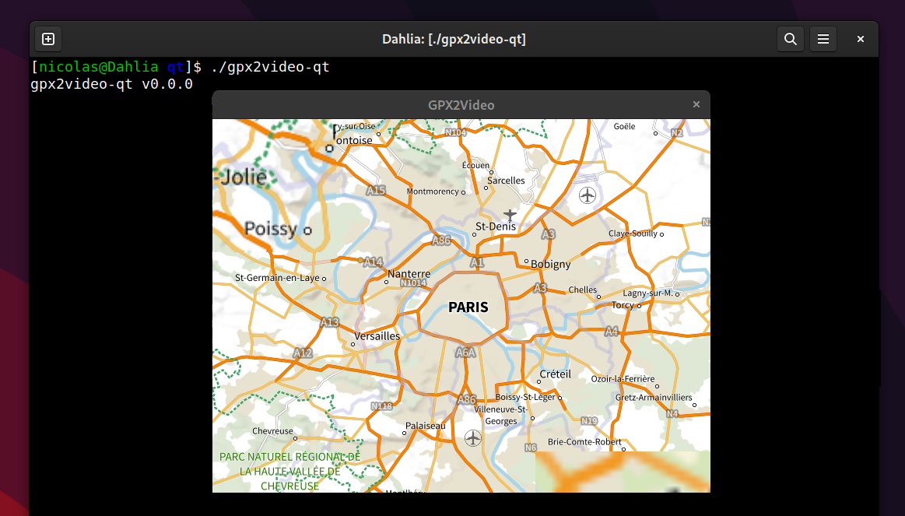

# GPX2Video Qt Interface - Telemetry overlay



Only to test!!!

To build gpx2video-qt, please install all Qt dependancies (on Debian Sid):

```bash
apt-get install qt5-qmake qtbase5-private-dev qtdeclarative5-private-dev \
    qtlocation5-dev 
```

Then build in using qmake tools:

```bash
$ apt-get source qtlocation-opensource-src
$ ln -s qtlocation-opensource-src-5.15.7+dfsg qtlocation-opensource-src
$ qmake
$ make
$ ./gpx2video-qt
```

