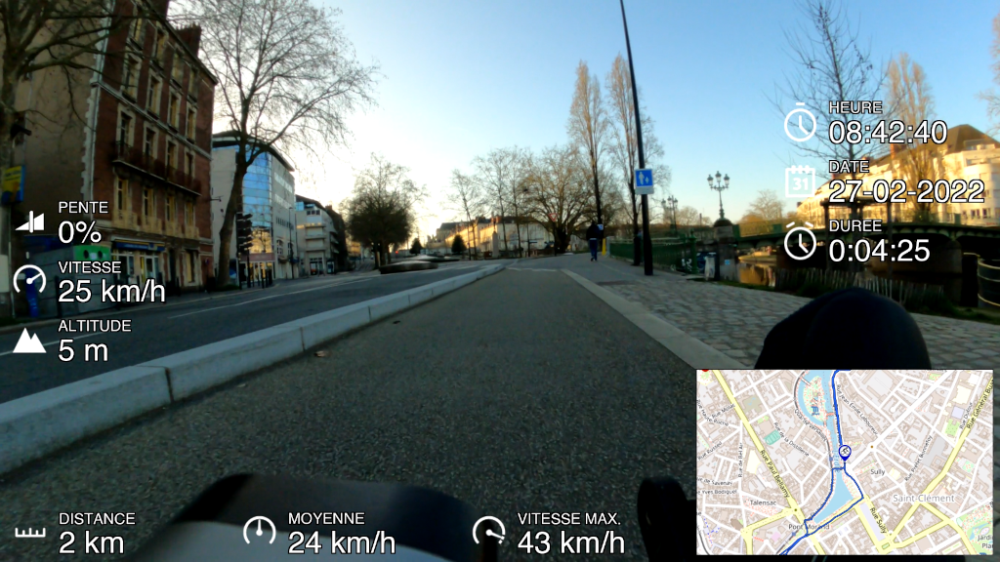

# GPX2Video command line tools

gpx2video can be used only in command line. Please follow documentation
to build gpx2video without gtk interface, or skip build part if your
use the user interface.



## Build

To build gpx2video, please install all dependencies (on Debian):

```bash
apt-get install cmake g++ gettext libevent-dev libssl-dev libcurl4-gnutls-dev \
    libavutil-dev libavformat-dev libavcodec-dev libavfilter-dev \
    libswresample-dev libswscale-dev libopenimageio-dev libgeographic-dev \
    libpango1.0-dev libcairo2-dev librsvg2-dev libopenexr-dev \
    libfreetype-dev
```

*Warning, on some distribution, libgeographic-dev is called libgeographiclib-dev!*

Then build in using cmake tools:

```bash
$ git clone https://github.com/progweb/gpx2video.git
$ mkdir gpx2video/build
$ cd gpx2video/build
$ cmake -DENABLE_GTK=OFF ..
$ make
$ ./gpx2video -h
```

*Please execute gpx2video tool from the build path so as it finds assets data.*


## How it works ?

gpx2video is able to extract and parse metadata and sensor data recorded by your GoPro.

```bash
$ ffprobe GH010337.MP4
ffprobe version 3.2.2 Copyright (c) 2007-2016 the FFmpeg developers
  built with gcc 6.2.1 (Debian 6.2.1-5) 20161124
...
Input #0, mov,mp4,m4a,3gp,3g2,mj2, from 'GH010337.MP4':
  Metadata:
    major_brand     : mp41
    minor_version   : 538120216
    compatible_brands: mp41
    creation_time   : 2021-12-08T09:56:26.000000Z
...
  Duration: 00:00:52.38, start: 0.000000, bitrate: 100345 kb/s
    Stream #0:0(eng): Video: h264 (High) (avc1 / 0x31637661), yuvj420p(pc, bt709), 2704x1520 [SAR 1:1 DAR 169:95], 100078 kb/s, 50 fps, 50 tbr, 90k tbn, 100 tbc (default)
    Metadata:
      creation_time   : 2021-12-08T09:56:26.000000Z
      handler_name    : GoPro AVC  
      encoder         : GoPro AVC encoder
      timecode        : 09:56:26:43
    Stream #0:1(eng): Audio: aac (LC) (mp4a / 0x6134706D), 48000 Hz, stereo, fltp, 189 kb/s (default)
    Metadata:
      creation_time   : 2021-12-08T09:56:26.000000Z
      handler_name    : GoPro AAC  
      timecode        : 09:56:26:43
    Stream #0:2(eng): Data: none (tmcd / 0x64636D74) (default)
    Metadata:
      creation_time   : 2021-12-08T09:56:26.000000Z
      handler_name    : GoPro TCD  
      timecode        : 09:56:26:43
    Stream #0:3(eng): Data: none (gpmd / 0x646D7067), 48 kb/s (default)
    Metadata:
      creation_time   : 2021-12-08T09:56:26.000000Z
      handler_name    : GoPro MET  
    Stream #0:4(eng): Data: none (fdsc / 0x63736466), 12 kb/s (default)
    Metadata:
      creation_time   : 2021-12-08T09:56:26.000000Z
      handler_name    : GoPro SOS  
```

gpx2video uses the `creation_time` field to synchronize your video with your GPX file. Warning, `creation_time`
is in local time. But this date isn't synchronized with the GPS source.

If gpx2video finds the 'GoPro MET' stream, it searches packet with GPS fix to determine the offset time to use. In
this case, the `creation_time` value is computed form 'GoPro MET' stream.

If the `creation_time` field and 'GoPro MET' stream can't be found, gpx2video assumes that the video starts in the
same time that the GPX stream.

At last, you can overwrite `creation_time` value in using --start-time option. As this option is used, gpx2video 
doesn't 

"sync" command permits to test the sychronization process:

```bash
$ ./gpx2video -v -m GOPR1860.MP4 sync
Time synchronization...
PACKET: 0 - PTS: 0 - TIMESTAMP: 0 ms - TIME: 2022-01-16 10:05:03 - GPS FIX: 0 - GPS TIME: 2022-01-16 10:01:38.959 - OFFSET: -205
PACKET: 1 - PTS: 1000 - TIMESTAMP: 1000 ms - TIME: 2022-01-16 10:05:04 - GPS FIX: 0 - GPS TIME: 2022-01-16 10:01:40.939 - OFFSET: -204
PACKET: 2 - PTS: 2000 - TIMESTAMP: 2000 ms - TIME: 2022-01-16 10:05:05 - GPS FIX: 0 - GPS TIME: 2022-01-16 10:01:41.929 - OFFSET: -204
PACKET: 3 - PTS: 3000 - TIMESTAMP: 3000 ms - TIME: 2022-01-16 10:05:06 - GPS FIX: 0 - GPS TIME: 2022-01-16 10:01:42.919 - OFFSET: -204
...
PACKET: 20 - PTS: 20000 - TIMESTAMP: 20000 ms - TIME: 2022-01-16 10:05:23 - GPS FIX: 0 - GPS TIME: 2022-01-16 10:01:59.969 - OFFSET: -204
PACKET: 21 - PTS: 21000 - TIMESTAMP: 21000 ms - TIME: 2022-01-16 10:05:24 - GPS FIX: 0 - GPS TIME: 2022-01-16 10:02:00.959 - OFFSET: -204
PACKET: 22 - PTS: 22000 - TIMESTAMP: 22000 ms - TIME: 2022-01-16 10:05:25 - GPS FIX: 0 - GPS TIME: 2022-01-16 10:02:01.949 - OFFSET: -204
PACKET: 23 - PTS: 23000 - TIMESTAMP: 23000 ms - TIME: 2022-01-16 10:05:26 - GPS FIX: 0 - GPS TIME: 2022-01-16 10:02:02.939 - OFFSET: -204
PACKET: 24 - PTS: 24000 - TIMESTAMP: 24000 ms - TIME: 2022-01-16 10:05:27 - GPS FIX: 2 - GPS TIME: 2022-01-16 10:02:03.929 - OFFSET: -204
Video stream synchronized with success (offset: -204 s)
Video start time is: 2022-01-16 10:01:38.960
```

At last, but not least, you can add an user offset (in ms).

```bash
$ ./gpx2video -m GOPR1860.MP4 --offset 9000 ...
```

```bash
$ ./gpx2video -m GOPR1860.MP4 --start-time "2021-12-08T09:56:26" --offset 300 ...
```

## Usage

gpx2video is a command line tool.

  - To extract GoPro GPMD data from media stream:

```bash
$ ./gpx2video -v -m GOPR1860.MP4 -o output.gpx --extract-format=3 extract
gpx2video v0.0.0
creation_time = 2020-12-13T09:56:27.000000Z
Failed to find decoder for stream #2
Failed to find decoder for stream #3
Input #0, mov,mp4,m4a,3gp,3g2,mj2, from '../../video/GOPR1860.MP4':
...
Extract GPMD data...
PACKET: 0 - PTS: 0 - TIMESTAMP: 0 ms - TIME: 1970-01-01 00:00:00
PACKET: 1 - PTS: 1001 - TIMESTAMP: 1001 ms - TIME: 1970-01-01 00:00:01
```

  - To render image per image with telemetry data:

```bash
$ mkdir png
$ ./gpx2video -v -m GH020340.MP4 -g ACTIVITY.gpx -l layout.xml -o png/image-XXXXXX.png image
gpx2video v0.0.0
...
```

One image per second will be generated. 'XXXXXX' will be replaced by the frame number

  - To render a video stream with telemetry data:

```bash
$ ./gpx2video -v -m GH020340.MP4 -g ACTIVITY.gpx -l layout.xml -o output.mp4 video
gpx2video v0.0.0
creation_time = 2021-12-08T10:34:50.000000Z
...
[read the input media metadata]
...
Track info:
  Name        : Road biking
  Comment     : 
  Description : 
  Source      : 
  Type        : road_biking
  Number      : 
  Segments:   : 1
Output #0, mp4, to 'output-overview.mp4':
  Stream #0:0: Video: h264, yuvj420p(pc), 2704x1520 [SAR 1:1 DAR 169:95], q=2-31, 32000 kb/s, 50 tbn
  Stream #0:1: Audio: aac (LC), 48000 Hz, stereo, fltp, 128 kb/s
Parsing layout.xml
Load widget 'grade'
Initialize grade widget
Load widget 'speed'
Initialize speed widget
Load widget 'elevation'
Initialize elevation widget
Load widget 'cadence'
Initialize cadence widget
Load map widget
Initialize map widget
Cache initialiization...
Time synchronization...
PACKET: 0 - PTS: 0 - TIMESTAMP: 0 ms - TIME: 2021-12-08 09:34:50 - GPS TIME: - OFFSET: 478042309
PACKET: 1 - PTS: 1000 - TIMESTAMP: 1000 ms - TIME: 2021-12-08 09:34:51 - GPS TIME: 2021-12-08 09:38:36.850 - OFFSET: 225
Video stream synchronized with success
Download map from OpenStreetMap I...
  Download tile 6 / 6 [##################################################] DONE
...
[Download, build map then draw your track]
...
Build map...
FRAME: 0 - PTS: 0 - TIMESTAMP: 0 ms - TIME: 2021-12-08 10:38:35
  Time: 2021-12-08 10:38:38. Distance: 35.841 km in 6330.000 seconds, current speed is 25.817 (valid: true)
FRAME: 1 - PTS: 1800 - TIMESTAMP: 20 ms - TIME: 2021-12-08 10:38:35
  Time: 2021-12-08 10:38:38. Distance: 35.841 km in 6330.000 seconds, current speed is 25.817 (valid: true)
[Process each frame]
...
```


### How change gauges ?

Gauges size and position and more can be set from the layout.xml file. (see: samples/layout-1920x1080.xml)

You can edit `layout.xml` file to enable/disable gauge or edit label and position or any settings:
```xml
<?xml version="1.0" encoding="UTF-8"?>
<layout>
	<widget x="250" y="450" width="600" height="120" position="left" orientation="vertical">
		<type>speed</type>
		<name>VITESSE</name>
		<margin>20</margin>
		<padding>5</padding>
		<value-unit>kph</value-unit>
	</widget>		
	<widget x="250" y="450" width="600" height="120" position="left" orientation="vertical">
		<type>elevation</type>
		<shape>text</shape>
		<name>ALTITUDE</name>
		<margin>20</margin>
		<padding>5</padding>
		<value-unit>m</value-unit>
	</widget>
	<widget x="250" y="450" width="600" height="120" position="right" orientation="vertical">
		<type>date</type>
		<name>DATE</name>
		<margin>20</margin>
		<padding>5</padding>
		<value-format>%d-%m-%Y</value-format>
	</widget>
	<widget x="250" y="450" width="600" height="120" position="left" orientation="vertical" display="false">
		<type>heartrate</type>
		<name>FREQ. CARDIAQUE</name>
		<margin>20</margin>
		<padding>5</padding>
	</widget>		
	<track x="800" y="300" width="640" height="480" position="none" display="false">
	</track>
	<map x="800" y="300" width="640" height="480" position="none">
		<source>1</source>
		<zoom>12</zoom>
		<factor>2.0</factor>
	</map>
</layout>
```

#### Shapes: text, arc or bar

Some gauges support different shapes: text, bar or arc. 

Default shape is text (label, value and icon)

WARNING: bar & arc shapes are in progress.

##### Text shape common settings

Here all widget common element settings:

```xml
<widget x="250" y="450" width="600" height="120" position="left" orientation="vertical" at="1000" duration="9000" display="true">
	<type>speed</type>
    <shape>text</shape>

	<name>SPEED</name>
	<margin>20</margin>
	<padding>5</padding>
	<border>5</border>
	<border-color>#000000b0</border-color>
	<background-color>#0000004c</background-color>

	<with-label>true</with-label>
	<label-font-size>20</label-font-size>
	<label-font-style>normal</label-font-style>
	<label-font-weight>400</label-font-weight>
	<label-horizontal-align>left</label-horizontal-align>
	<label-vertical-align>center</label-vertical-align>
	<label-color>#00ff00ff</label-color>
	<label-shadow-opacity>3</label-shadow-opacity>
	<label-shadow-distance>3</label-shadow-distance>
	<label-border-width>2</label-border-width>
	<label-border-color>#000000ff</label-border-color>

	<with-value>true</with-value>
	<value-font-size>20</value-font-size>
	<value-font-style>normal</value-font-style>
	<value-font-weight>400</value-font-weight>
	<value-horizontal-align>left</value-horizontal-align>
	<value-vertical-align>center</value-vertical-align>
	<value-color>#00ff00ff</value-color>
	<value-shadow-opacity>3</value-shadow-opacity>
	<value-shadow-distance>3</value-shadow-distance>
	<value-border-width>2</value-border-width>
	<value-border-color>#000000ff</value-border-color>

	<icon-color>#00ff00ff</icon-color>
    <line-space>5</line-space>

	<with-icon>true</with-icon>
	<with-unit>true</with-unit>
</widget>		
```

Node attributes are:
  - **x** / **y**: to set the widget position.
  - **width** / **height**: to set the widget size.
  - **position**: to compute the widget position.
  - **orientation**: to set the horizontal / vertical alignment.
  - **at** / **duration**: to display widget at a specific time (in ms) during a specific duration (in ms).
  - **display**: to render or not the widget.

Node elements are:
  - **type**: to set the widget type (speed, grade, distance...).
  - **name**: to set the widget label.
  - **font**: to set the text font.
  - **margin**: to set the space around the widget (**margin-left**, **margin-right**, **margin-top** and **margin-bottom** are supported too).
  - **padding**: to set the space inside the widget (**padding-left**, **padding-right**, **padding-top** and **padding-bottom** are supported too).
  - **border**: to set the border width.
  - **border-color**: to set the border color in #RGBA.
  - **background-color**: to set the background color in #RGBA.

Label or value node elements are:
  - **xxxx-font-size**: to set the text size.
  - **xxxx-font-style**: to set the text style (normal or italic).
  - **xxxx-font-weight**: to set the text weight value (100, 200, 300, 350, 380, 400, 500, 600, 700, 800, 900 or 1000)).
  - **xxxx-color**: to set the text color in #RGBA.
  - **xxxx-horizontal-align**: to set text horizontal alignement (left, center, right)
  - **xxxx-vertical-align**: to set text vertical alignement (top, center, bottom)
  - **xxxx-shadow-opacity**: text shadow opacity (in percent).
  - **xxxx-shadow-distance**: text shadow thickness.
  - **xxxx-border-width**: to set the text border width.
  - **xxxx-border-color**: to set the text border color in #RGBA.

Other settings:
  - **with-xxxx**: to show or not the field (default is true).

**type** gauges supported are:
  - speed, maxspeed, avgspeed, avgridespeed
  - grade, elevation, verticalspeed
  - date, time, duration
  - course, heading,
  - position
  - distance
  - cadence
  - heartrate
  - temperature
  - gforce
  - image
  - lap
  - text

**position** values are: none, left, right, top, bottom, bottom-left, bottom-right, top-left, top-right.
If **position** element is set, gpx2video ignores and computes **x** and **y** values.

**orientation** values are: horizontal or vertical.
If **position** isn't defined, orientation value isn't used.

**display** values are: true or false. It permits to render or not the widget.
The **display** default value is true.


**padding** value sets the space around the text. Whereas, **margin** value defines the space around the widget.

##### Arc shape common settings

TODO (in devel)

##### Bar shape common settings

TODO (in devel)

#### Widget units

You can specify units for some widgets.

##### speed, maxspeed, avgspeed and avgridespeed widgets

```xml
<widget>
	<type>speed</type>
	<value-unit>kph</value-unit>
</widget>		
```

**value-unit** values are: mph, kph, mpm / minpermile, mpk / minperkm.


##### vertical speed widget

```xml
<widget>
	<type>verticalspeed</type>
	<value-unit>mps</value-unit>
</widget>		
```

**value-unit** values are: mps / meterpersec, milespersec.


##### distance widget

```xml
<widget>
	<type>distance</type>
	<value-unit>km</value-unit>
</widget>		
```

**value-unit** values are: m, km, ft or miles.


##### elevation widget

```xml
<widget>
	<type>elevation</type>
	<value-unit>m</value-unit>
</widget>		
```

**value-unit** values are: m or ft.


##### date widget

```xml
<widget>
	<type>date</type>
	<value-format>%Y-%m-%d</value-format>
</widget>		
```


##### temperature widget

```xml
<widget>
	<type>temperature</type>
	<value-unit>C</value-unit>
</widget>		
```

**value-unit** values are: C, celsius or F, fahrenheit.


##### g-force widget

```xml
<widget>
	<type>gforce</type>
	<value-unit>g</value-unit>
</widget>		
```

**value-unit** values are: g or meterpersec2.


##### lap widget

```xml
<widget>
	<type>lap</type>
	<nbr-lap>10</nbr-lap>
</widget>		
```

**nbr-lap** value is the lap target number.


##### image widget

```xml
<widget>
	<type>image</type>
	<zoom>stretch</zoom>
	<source>fichier.jpg</source>
</widget>		
```

**zoom** values are: none, fit, fill, crop and stretch. This parameter is used only by the image widget.
**source** is optional.


##### text widget

```xml
<widget>
	<type>text</type>
	<text>Rendered with GPX2Video application</text>
</widget>		
```


## Maps

You can specify map source from a list. Warning, all maps aren't free.

gpx2video downloads each tile with the zoom level in your `~/.gpx2video/cache` path. 
Then build the map.

Finally, gpx2video renders a mapbox in applying the zoom factor.

As you use map or track command line, please provide map settings (source, zoom, factor) on the
command lines.

  - To render map:

```bash
$ ./gpx2video -g ACTIVITY.gpx -o map.png --map-source=1 --map-zoom=11 --map-factor 2.0 map
```

  - To render map & track:

```bash
$ ./gpx2video -g ACTIVITY.gpx -o map.png --map-source=1 --map-zoom=11 --map-factor 2.0 track
```

**--map-source** to select map provider. Map providers list is given by the option **--map-source-list**.

Map settings: 

```xml
<map x="250" y="450" width="600" height="120" position="left" display="true">
	<source>1</source>
	<zoom>11</zoom>
	<view>default</view>
	<factor>1.2</factor>
    <with-icon-start>true</with-icon-start>
    <with-icon-end>true</with-icon-end>
    <with-icon-position>true</with-icon-position>
	<icon-end-name>default</icon-end-name>
	<icon-start-name>default</icon-start-name>
	<icon-position-name>default</icon-position-name>
	<icon-end-size>1</icon-end-size>
	<icon-start-size>1</icon-start-size>
	<icon-position-size>1</icon-position-size>
	<border>5</border>
	<border-color>#000000b0</border-color>
	<background-color>#0000004c</background-color>
	<path-thick>3.0</path-thick>
	<path-border>1.4</path-border>
</map>		
```

**source** map provider.
**zoom** value sets the map details.
**factor** value applies a zoom factor as render.
**icon-xxxx-size** icon size in pixels.
**path-thick** path thick.
**path-border** border size of path.

**with-icon-xxxx** enable/disable start, end or position icon.

**view** values are "zoomfit", "center", "default".

As **view** is set to "zoomfit", gpx2video computes **factor** value to fit the map in the widget area. 
In this case, **factor** value is ignored.

Map widget can be auto positionned as **x**, **y** and/or **width**, **height** aren't set. 
At last, you can define several map widgets.

*Map widget accepts the same common attibutes and elements that the standard widget (**at**, **duration**...)*


## Tracks

You can also display only the track without the map background in using track widget.

Track settings: 

```xml
<track x="250" y="450" width="600" height="120" position="left" display="true">
    <with-icon-start>true</with-icon-start>
    <with-icon-end>true</with-icon-end>
    <with-icon-position>true</with-icon-position>
	<icon-end-name>default</icon-end-name>
	<icon-start-name>default</icon-start-name>
	<icon-position-name>default</icon-position-name>
	<icon-end-size>1</icon-end-size>
	<icon-start-size>1</icon-start-size>
	<icon-position-size>1</icon-position-size>
	<view>zoomfit</view>
	<factor>1.2</factor>
	<border>5</border>
	<border-color>#000000b0</border-color>
	<background-color>#0000004c</background-color>
	<path-thick>3.0</path-thick>
	<path-border>1.4</path-border>
</widget>		
```

**view** values are "zoomfit", "center", "default".

As **view** is set to "zoomfit", gpx2video computes **factor** value to fit the track in the widget area. 
In this case, **factor** value is ignored.

*Track widget accepts the same common attibutes and elements that the standard widget (**at**, **duration**...)*

**path-thick** path thick.
**path-border** border size of path.

